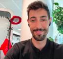

I think Juan Carlos has made a huge progress since he started as a junior consultant and, in my opinion, he is far above of what you can expect from a junior.

From a skills perspective, he has developed a huge knowledge about Ansible, Openshift, Satellite and RHEL, but he also knows where you can find help when you need it, which is the same or more important. I started to work with him as my shadowee and he was exactly what you expect from a shadowee, humble, keeping attention and always asking or noting question for later.

I have also worked with him in a gig where he was working alone and I helped them a little bit with Satellite. He knows how to talk and manage clients which is not easy at all. He noted the questions that he didn't know about and tried to help them in every area they needed, even when it wasn't his area of expertise and he needed to look for help. He is capable of carrying solo gigs without issues, an achievement to be proud of for someone who has been working in consulting for a year.

Besides, the best part of him is his attitude, you can tell from the first moment that he is eager to learn new things, he is always studying some certificate or new courses, reaching out to colleagues when he is in PD and trying to find out if there is anything interesting he can learn or help with.
