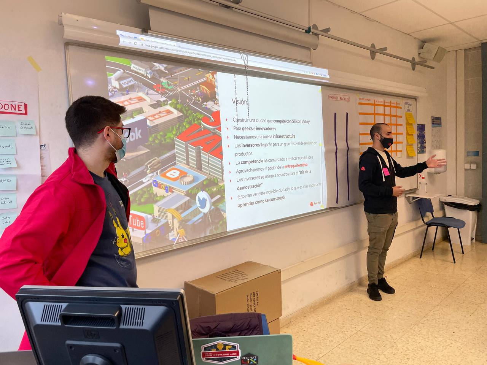
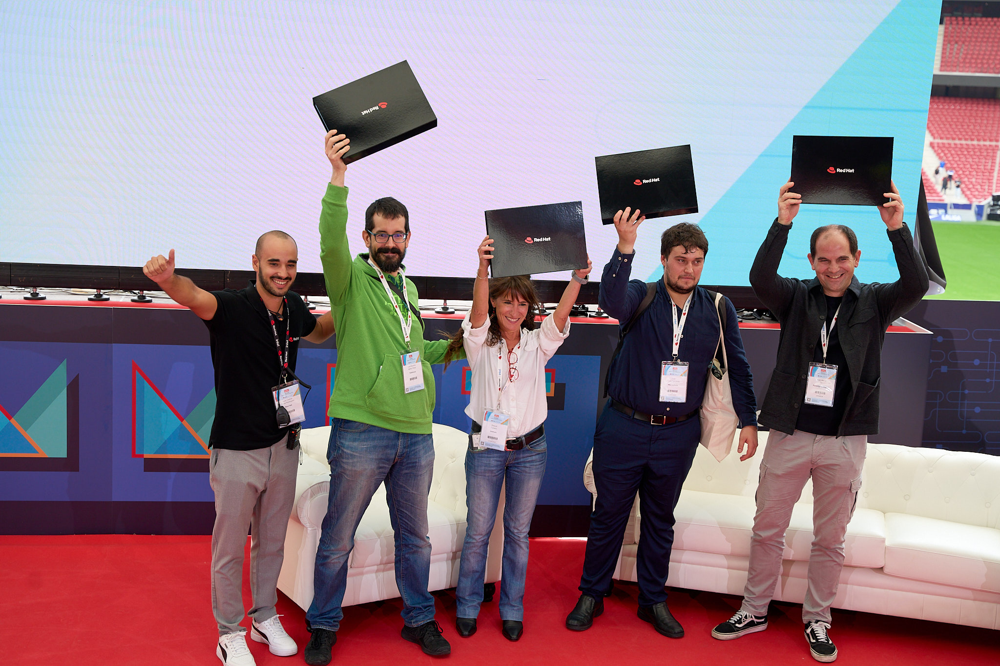
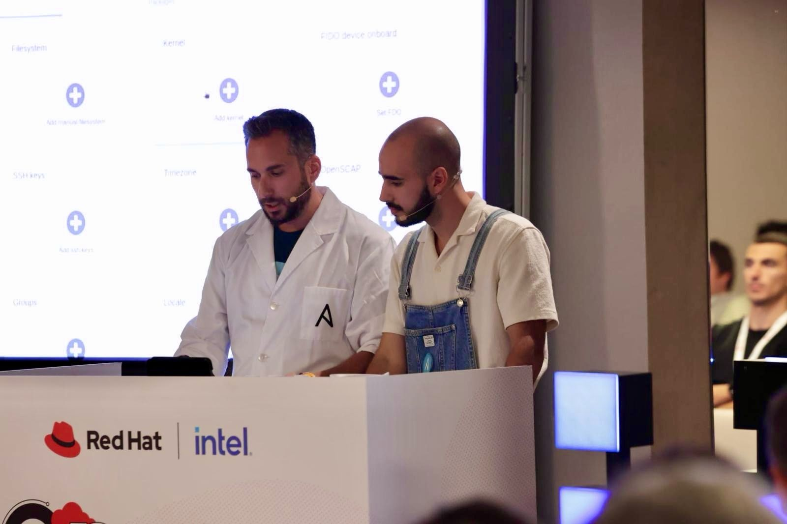
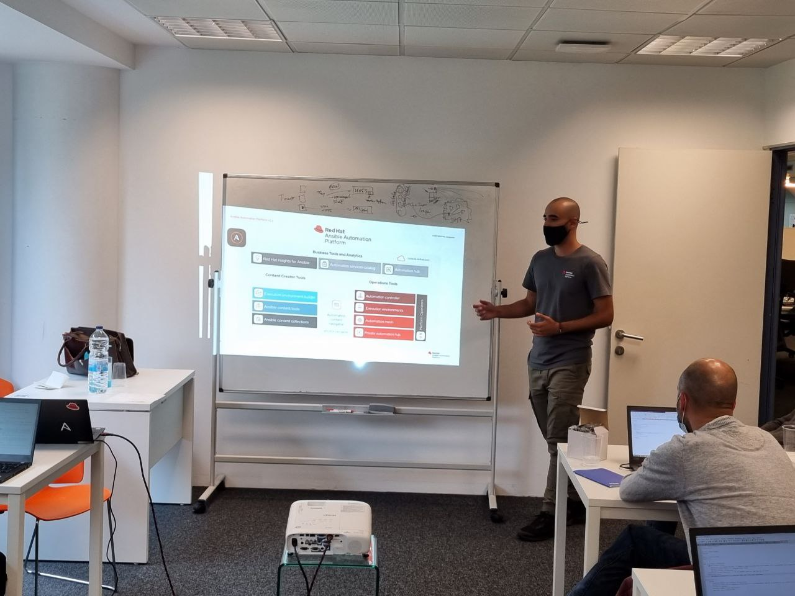

## Community contributions

| Contribution | Date | Description | Graphics |
| ------------- | ----------- | ----------- | ----------- |
| Technical Blog - Share knowledge with a wider audience on the internet | 2024 | As one of my goals in 2024, I've been working on a blog page to upload content related to technical topics. In the commin month my plan is to make it grow https://jtovarro.github.io/blog |  |
| CNCF Ambassador | 2023 | Currently working to organize new CNCF events hosted in Madrid, our commitment as team is to share technical knowledge not only at Red Hat but beyond our frontiers. Let's grow the community! Go to the official page to see upcomming events: https://community.cncf.io/cloud-native-madrid-1/. **Collaboration Teresa Giner, Alicia Maroto, Ricardo Noriega and colleagues from Solo.io and Suse.** |  |
| Community Valencia Twitch Meet-up | 2023 | Twitch Meet-Up: Secret Management following GitOps strategies. [Youtube Video](https://www.youtube.com/watch?v=JxTJMqEoovQ&t=3259s). **Collaboration Asier Cidón** |  |
| Lego Lab at Universitat Politecnica de Catalunya | 2022 | Introducing agile methodologies among UPC students using the class as space to play and learn. **Collaboration Ernesto Chacón and Jordi Olivé** |  |
| Bachelor's thesis | 2019 | Bachellor Thesis associated with the Las Palmas de Gran Canaria Univeristy. Integration and optimization of ML and IA applications with Kubernetes: https://accedacris.ulpgc.es/handle/10553/76839 |  |

## Internal contributions

| Contribution | Date | Description | Graphics |
| ------------- | ----------- | ----------- | ----------- |
| Validated Patterns | 2024 | TO BE ADDED |  |
| Iberia Meetup - Leapp and In-Place Upgrades talk | 2024 | In this session we will present our experience and some of the lessons learned at AXA (France). In this project we have worked from Consulting to facilitate, optimise and reduce human errors when updating their server fleet, using: Ansible to standardise and automate the upgrade process and Leapp as an upgrade tool; which allows us to benefit from the new features that RHEL has (and support), without the need to install new machines. [Session Reocrded](https://drive.google.com/file/d/1Bpy_Npp3iI0DH9k4nyLUak25sBqjY28H/view) |  |
| Gymkhana facilitator - Graduation Program event at Brno | 2023 | Exported alongside the spanish 2021 cohort Alicia and Agustin the Gymkhana delivered in the Red Hat Summit Madrid to the graduation event that take place every year in Brno. We delivered this activity modified in terms of challenges and technologies to fit the attendants needs. The Gymkhana challenges and delivery was supreme as reported by the feedback requested. **Collaboration Alicia Maroto and Agustín Algorta** |  |
| Red Hat Summit - Madrid | 2023 | Been the Red Hat team lead to the Gymkhana activity with our customers to facilitate one of the most attracting initiatives done in Iberia ever. |  |
| EMEA TAM Mock Project | 2023 | Internal project to support the success of the EMEA Graduate Program. In this initiative we have been supporting the Technical Account Manager rotation for new cohorts with actions such as creating support cases and acting as "real customers", so the Graduates could interact with support cases in Salesforce. And start to use TSE best practices while improving their technical skills at the same time: searching for KCS, documentation or even asking for help if they get stuck with the cases. All the documentation is in this [folder](https://drive.google.com/drive/folders/1fXCLU1W_lHC-B8cfQaNiPSDeA7SKPHIS) and also a [review](https://docs.google.com/forms/d/1JyOdtPmofik4hXpHI3vxvpshbuhgCxFYQPr7FH6RBSk/edit#responses) from the Graduates with 5/5 starts. **Collaboration Alicia Maroto and Agustín Algorta** |  |
| Red Hat Solution published | 2022 | Compliance Operator rules kernel-module are FAILED after being APPLIED in OpenShift Container Platform 4: https://access.redhat.com/solutions/6973351. **Collaboration José Márquez** |  |
| Buddy | 2022 | Working closely to New Hirings, supporting them in everything they need at the begining of the journey. As buddy I tried to be as transparent as possible with my experience during my Graduate Program, provided tips, and together we try to get the best of the Graduate experience. Identifying when something is not going as expected and searching for mentors working in the area of New Hiring colleagues interest. |  |

## Sales contributions

| Contribution | Date | Description | Graphics |
| ------------- | ----------- | ----------- | ----------- |
| Open Tour Bilbao | 2024 | Managing the Edge with Ansible and RHEL OSTree demo speaker. **Collaboration with Luis Boubeta** |  |
| Red Hat Quay at BBVA | 2023 | [Slides](https://docs.google.com/presentation/d/1XoZuvzp72or_o-43IETURtU2M7TLXQJt2Wp2MHOCbJM/edit#slide=id.g252eb1d4225_0_9556). **Collaboration Miguel Ángel Saez, Carlos Cornejo** |  |
| Advanced Cluster Management couse delivered at Capgemini | 2023 | Explaining to app dev technical audience at High Potencial program in Capgemini about Cloud Computing benefits of using Advanced Cluster Management, to administrate the clusters fleet and deploy applications and policies the GitOps way. **Collaboration Luis Boubeta** |  |
| WorkAthon at Red Hat Summit Connect Madrid | 2022 | Supporting this activity in the Summit Connect: reviewing laboratiories, and helping to both partners and customers during the activity day. Also colecting feedback and questions from customers to further analysis. **Supervision Moisés Rivera** |  |
| Red Hat Middleware solutions | 2022 | Explaining to Grifols, a pharma customer, about Red Hat Middleware portfolio and its benefits. Link to the [vídeo](https://drive.google.com/drive/folders/1tnPelN4nLtPk2V4WilXTXQn6R604Qlpb) and [slides](https://docs.google.com/presentation/d/1YGkT-_bzHopX1mwB8GnYG5rBaDCE83hkEbpHg3J3q3k/edit#slide=id.g12876cb2376_0_751) used. **Collaboration Àngel Ollé** |  |
| Onsite AAP demo for Seidor Technicians  | 2022 | Showing Red Hat partner in Zaragoza, Seidor, about new features included in Ansible Automation Platform v2.0. **Collaboration Moises Rivera** |  |

