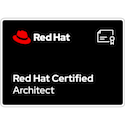

Follow this [link](https://www.credly.com/users/jtovarro) to explore all of them at Credly.com

## Red Hat Certifications

| Certification | Date issued |
| ------------- | ----------- |
| Building Resilient Microservices with Istio and Red Hat OpenShift Service Mesh  | March 2024  |
| Red Hat Certified Architect (RHCA) | March 2023 |
| Red Hat Certified Specialist in OpenShift Application Developer | March 2023 |
| Red Hat Certified Specialist in MultiCluster Management | January 2023 |
| Red Hat Certified Specialist in contanariezed applications | October 2022 |
| Open Library Practices - TL500 in London | July 2022 |
| Red Hat Certified Engineer | July 2022 |
| Red Hat Certified Specialist in OpenShift Administration | May 2022 |
| Red Hat Certified System Administrator | January 2022 |

## Other Trainings and Certifications

| Certification | Date issued |
| ------------- | ----------- |
| Fundamentals for Istio by Solo.io | March 2023 |
| Microsoft Azure Fundamentals | December 2022 |
| GitOps at Scale by CodeFresh | October 2022 |
| GitOps Fundamentals by COdeFresh | April 2022 |

## Soft Skills Trainings

Soft Skills courses represent a total of 40 hours approximately.

| Certification |
| ------------- |
|  7 Habits of Highly Effective People (vILT) |
| Giving and Receiving Feedback from Associates (vILT) |
| 5 Choices to Extraordinary Productivity (vILT) |
| Development Beyond Learning (DBL) courses |
| Careers Journeys (vILT) |
| Communicating with Virtual Presence (vILT) |